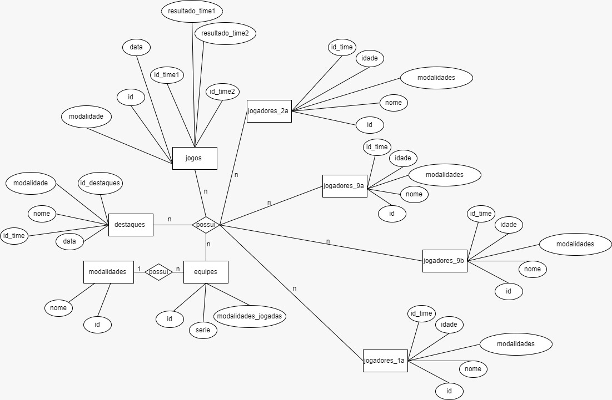

# Projeto Banco de Dados Interclasse

Projeto feito por: Olavo, Dahra, Isabelle, Duda Berto, Miriam, Eloá e Maria

```
drop database if exists interclasse_sesi2024;
CREATE DATABASE interclasse_sesi2024;
USE interclasse_sesi2024;

CREATE TABLE modalidades (
  id INT PRIMARY KEY,
  nome VARCHAR(255) NOT NULL
);

CREATE TABLE times (
  id INT PRIMARY KEY,
  serie VARCHAR(255) NOT NULL,
  modalidades_jogadas VARCHAR(255) NOT NULL
);

CREATE TABLE jogadores (
  id INT PRIMARY KEY,
  nome VARCHAR(255) NOT NULL,
  idade INT NOT NULL,
  modalidades VARCHAR(255) NOT NULL,
  id_time INT NOT NULL,
  FOREIGN KEY (id_time) REFERENCES times(id)
);

CREATE TABLE jogos (
  id INT PRIMARY KEY,
  id_time_1 INT NOT NULL,
  id_time_2 INT NOT NULL,
  modalidade INT NOT NULL,
  data DATE NOT NULL,
  resultado_time_1 INT NOT NULL,
  resultado_time_2 INT NOT NULL,
  FOREIGN KEY (id_time_1) REFERENCES times(id),
  FOREIGN KEY (id_time_2) REFERENCES times(id),
  FOREIGN KEY (modalidade) REFERENCES modalidades(id)
);

CREATE TABLE destaques (
    id_destaques INT PRIMARY KEY AUTO_INCREMENT,
    nome VARCHAR(255) NOT NULL,
    id_time INT NOT NULL,
    modalidade int NOT NULL,
    data VARCHAR(255) NOT NULL,
  FOREIGN KEY (modalidade) REFERENCES modalidades(id),
  FOREIGN KEY (id_time) REFERENCES times(id)
);

INSERT INTO modalidades (id, nome) values
(1, 'vôlei feminino'),
(2, 'vôlei misto'),
(3, 'futebol society'),
(4, 'dama'),
(5, 'futsal'),
(6, 'xadrez'),
(7, 'futmesa'),
(8, 'badminton'),
(9, 'futsal feminino');

INSERT INTO times (id, serie,  modalidades_jogadas) values
(1, '9a', 'vôlei misto, futebol society, badminton, xadrez, futsal'),
(2, '9b', 'futebol society, volei misto, badminton, xadrez'),
(3, '1a', 'vôlei feminino, volei misto, futebol society, dama, futsal feminino, futsal, xadrez, futmesa'),
(4, '2a', 'vôlei feminino, volei misto, futebol society, futsal, futsal feminino, dama, xadrez, futmesa'),
(5, '1b', 'dama, futsal, futmesa, xadrez');

INSERT INTO jogadores (id, nome, idade, modalidades, id_time) values
(1, 'Enzo', 14, 'vôlei misto, futsal, futebol society', 1),
(2, 'Tobias', 14, 'vôlei misto, futebol society', 1),
(3, 'Pedro', 14, 'vôlei misto, futsal, futebol society', 1),
(4, 'Caio', 14, 'vôlei misto, futmesa, futsal, futebol society', 1),
(5, 'Otávio', 14, 'vôlei misto, futsal, futebol society', 1),
(6, 'Briam', 14, 'futebol society', 1),
(7, 'Lavinia', 14, 'vôlei misto', 1),
(8, 'Marina', 14, 'vôlei misto', 1),
(9, 'Vitor', 14, 'vôlei misto', 1),
(10, 'Heitor', 14, 'vôlei misto', 1),
(11, 'Samuel', 14, 'futebol society', 2),
(12, 'Samuel Bueno', 16, 'futebol society, futsal, futmesa', 2),
(13, 'Thiago', 14, 'futebol society, futsal, futmesa', 2),
(14, 'Kauã', 15, 'futebol society, futsal, futmesa', 2),
(15, 'Miguel S', 14, 'futebol society', 2),
(16, 'João Henrique', 14, 'futebol society, volei misto, futsal', 2),
(17, 'Davi Cardial', 15, 'futebol society', 2),
(18, 'Juliano', 15, ' futebol society, vôlei misto, futsal', 3),
(19, 'Davi', 15, 'futebol society, futsal', 3),
(20, 'Kaique', 15, 'futebol society, futsal, volei misto', 3),
(21, 'Leandro', 15, 'futebol society, futsal, vôlei misto', 3),
(22, 'Luiz', 15, 'futebol society, futsal', 3),
(23, 'Luis S', 15, 'futebol society, futsal, vôlei misto', 3),
(24, 'Ítalo', 15, 'futebol society', 3),
(25, 'Luiza', 15, 'vôlei misto, volei feminino, futsal feminino', 3),
(26, 'Beatriz', 15, 'vôlei feminino', 3),
(27, 'Mirella', 15, 'vôlei misto, volei feminino', 3),
(28, 'Clara', 15, 'vôlei misto, volei feminino, futsal feminino', 3),
(29, 'Tamires', 15, 'vôlei misto, volei feminino, futsal feminino', 3),
(30, 'João Vitor', 15, 'vôlei misto', 3),
(31, 'Pietra', 15, 'vôlei misto, volei feminino, futsal feminino', 3),
(32, 'Henrico', 16, 'futebol society, futmesa, volei misto', 4),
(33, 'Leonardo', 16, 'futebol society, volei misto, futmesa', 4),
(34, 'Guilherme C', 16, 'futebol society, futsal, volei misto', 4),
(35, 'Guilherme S', 16, 'futebol society, futmesa, futsal, volei misto', 4),
(36, 'Hasmann', 16, 'futebol society, futsal', 4),
(37, 'Matheus', 16, 'futebol society, futsal', 4),
(38, 'Olavo', 16, 'futebol society, futsal, futmesa, dama, xadrez, volei misto', 4),
(39, 'Milena', 16, 'vôlei feminino, volei misto, futsal feminino', 4),
(40, 'Isabelle', 16, 'vôlei feminino, volei misto, futsal feminino', 4),
(41, 'Gabriela', 16, 'vôlei feminino, volei misto, futsal feminino', 4),
(42, 'Dahra', 16, 'vôlei feminino, volei misto', 4),
(43, 'Lohaine', 16, 'vôlei feminino', 4),
(44, 'Duda B', 16, 'vôlei feminino', 4),
(45, 'João Lucas', 16, 'futebol society', 4),
(46, 'Nicollas', 15, 'dama', 5),
(47, 'Jéssica', 14, 'dama', 1),
(48, 'Duda Berto', 16, 'futsal feminino', 4),
(49, 'Nicole', 16, 'futsal feminino', 4),
(50, 'Letícia Correa', 16, 'futsal feminino', 3),
(51, 'Mariana', 15, 'futsal feminino', 3),
(52, 'Kamilly', 14, 'badminton', 2 ),
(53, 'Ana Clara', 14, 'volei misto', 2),
(54, 'Alicia', 14, 'volei misto, badminton', 2),
(55, 'Isabelly', 14, 'volei misto', 2),
(56, 'Enzo M', 15, 'volei misto', 2),
(57, 'Pignata', 14, 'volei misto', 2),
(58, 'Mirella C', 14, 'volei misto', 2),
(59, 'Vinicius', 16, 'futsal', 5),
(60, 'Carlos', 16, 'futsal', 5),
(61, 'Laila', 16, 'volei feminino', 4),
(62, 'Henrique', 16, 'futsal', 5),
(63, 'Kauã Lúcio', 16, 'futsal', 5);

INSERT INTO jogos (id, id_time_1, id_time_2, modalidade, data, resultado_time_1, resultado_time_2) values
(1, 3, 1, 2, '2024-09-23', 2, 0),
(2, 3, 4, 1, '2024-09-23', 1, 0),
(3, 4, 2, 3, '2024-09-23', 10, 2),
(4, 4, 3, 3, '2024-09-23', 7, 1),
(5, 3, 1, 3, '2024-09-23', 2, 0),
(6, 4, 3, 2, '2024-09-26', 2, 0),
(7, 4, 3, 1, '2024-09-26', 0, 2),
(8, 1, 2, 2, '2024-09-26', 2, 1),
(9, 2, 4, 2, '2024-09-30', 2, 1),
(10, 1, 4, 2, '2024-09-30', 2, 1),
(11, 4, 5, 5, '2024-10-03', 4, 1),
(12, 1, 3, 5, '2024-10-03', 4, 3),
(13, 3, 4, 5, '2024-10-03', 6, 1);

INSERT INTO destaques (id_destaques, nome, id_time, modalidade, data) values
(1, 'Tamires', 3, 2, '2024-09-23'),
(2, 'Caio', 1, 2, '2024-09-23'),
(3, 'Guilherme S', 4, 3, '2024-09-23'),
(4, 'Miguel S', 2, 3, '2024-09-23'),
(5, 'Enzo', 1, 3, '2024-09-23'),
(6, 'Davi', 3, 3, '2024-09-23'),  
(7, 'Mirella', 3, 1, '2024-09-23'),
(8, 'Milena', 4, 1, '2024-09-23'),
(9, 'Gabriela', 4, 2, '2024-09-26'),
(10, 'Milena', 4, 1, '2024-09-26'),
(11, 'Tamires', 3, 2, '2024-09-23'),
(12, 'Tamires', 3, 1, '2024-09-23'),
(13, 'A ver', 1, 2, '2024-09-26'),
(14, 'A ver', 2, 2, '2024-09-26'),
(15, 'Nicollas', 5, 4, '2024-09-26'),
(16, 'Jéssica', 2, 4, '2024-09-26'),
(17, 'Olavo', 4, 4, '2024-09-26'),
(18, 'Pignata', 2, 2, '2024-09-30'),
(19, 'Milena', 4, 2, '2024-09-30'),
(20, 'Isabelle', 4, 9,'2024-10-03'),
(21, 'Letícia Correa', 3, 9,'2024-10-03'),
(22, 'Enzo', 1, 5,'2024-10-03'),
(23, 'Davi', 3, 5,'2024-10-03'),
(24, 'Guilherme S', 4, 5,'2024-10-03'),
(25, 'Henrique', 5, 5,'2024-10-03');

```

